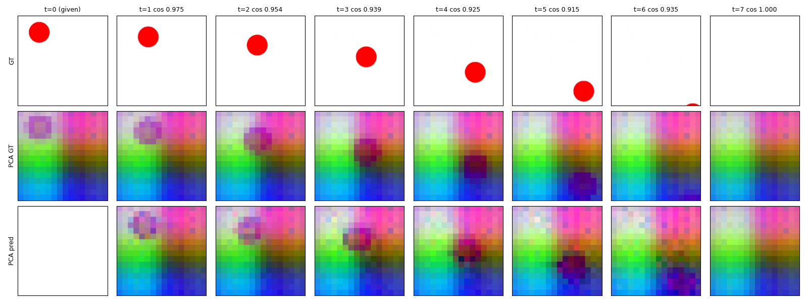
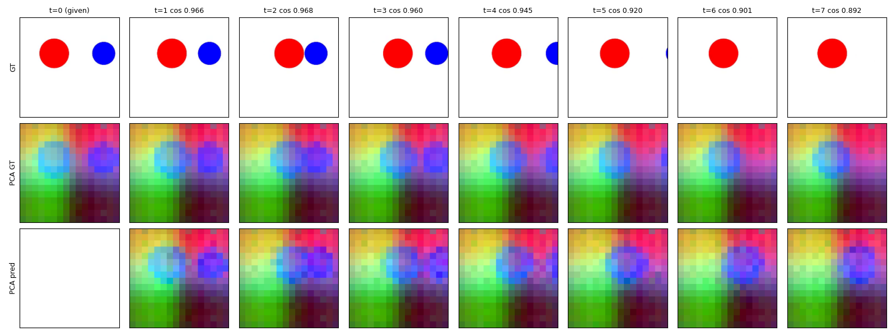
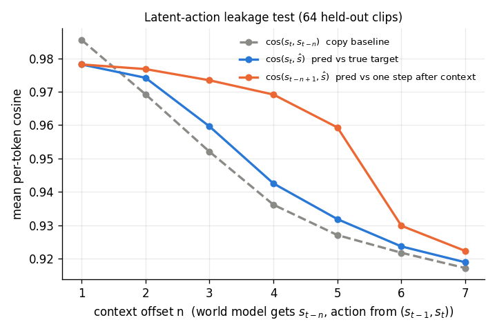

# IDM

Inverse dynamics model (IDM) experiments. An IDM infers a **latent action** from a pair of frames. A flow-matching **world model** then predicts the next frame from the current frame and that action. Both models are trained jointly on frozen DINOv3 features, using toy videos of moving balls.

```
frames (x_{t-1}, x_t) ──► DINOv3 (frozen) ──► (s_{t-1}, s_t)
                                                  │
                         IDM(s_{t-1}, s_t) ──► a_t  (VAE bottleneck, 256-d)
                                                  │
                   WorldModel(s_{t-1}, a_t) ──► ŝ_t  (flow matching, DDT head)
```

- **Backbone:** `facebook/dinov3-vitl16-pretrain-lvd1689m`, averaging layers 6/12/18/24, on a 16×16 patch grid at 256 px.
- **IDM** ([src/idm.py](src/idm.py)): a cross-attention transformer with a VAE bottleneck. The design follows LaWAM.
- **World model** ([src/world_model.py](src/world_model.py), [src/flow.py](src/flow.py)): a DDT-style transformer trained with flow matching and sampled with 50 Euler steps. The design follows Flow-World-Models.

## Setup

```bash
bash setup.sh                     # conda env "gssl" (py3.10), torch cu126, ffmpeg
pip install -r requirements.txt
huggingface-cli login             # DINOv3 is gated: accept the license on Hugging Face first
```

## Data

The data is HDF5 files of 32-frame, 256×256 clips at 10 fps, with ball positions stored for each frame (see [src/data.py](src/data.py)).

| Dataset | Contents |
|---|---|
| `collision_30K.hdf5` | two balls that collide (~26K clips) |
| `parabola_300K.hdf5` | one ball on a parabolic path (300K clips) |
| `uniform_motion_30K.hdf5` | one ball at constant velocity |

## Usage

```bash
# train
python train.py configs/training_toy_data.yaml     # collision
python train.py configs/training_parabola.yaml     # parabola

# autoregressive rollout on held-out clips (horizon <= 7 with frame_gap 4)
python rollout.py runs/parabola/step_10000.pt --horizon 7 --data dataset/parabola_eval.hdf5
```

The ablations live in [ablations/](ablations/), and each script's docstring explains what it tests:

| Script | Question |
|---|---|
| `latent_action.py` | Does the action leak the whole next frame? |
| `context_noise.py` | Does the world model read the scene from the context or from the action? |
| `latent_probe.py` | What does the latent action encode (position, velocity, size)? |
| `velocity_action.py` | Can the true ball displacement replace the latent action? |
| `error_compounding.py` | How much error accumulates over autoregressive rollouts? |

## Results (step 10K)

Scores are per-token cosine similarity between the predicted and true next-frame features, on held-out clips.

| Run | Predicted | Copy baseline (previous frame) |
|---|---|---|
| Parabola | **0.988** | 0.945 |
| Collision | **0.979** | 0.955 |

- **The latent action behaves like the real action.** On parabola, a world model driven by the IDM's action matches one driven by the ball's true displacement. Cosine over the ball's patches is 0.849 with the latent action and 0.852 with the true displacement, against 0.539 for the copy baseline. A linear probe on the latent action recovers the ball's velocity far better than chance: squared error 2.8 vs 14.9 (px/frame)² in y, and 14.8 vs 27.0 in x.
- **Over 7 steps, rollouts keep track of the ball.** The world model rolls forward from only the first ground-truth frame, using the IDM's actions.




- **The action does not leak the next frame.** Give the world model an older context s_{t−n} with the action for (s_{t−1}, s_t): its prediction matches the step after its context (orange), not the true target (blue).



## Acknowledgements

[Flow-World-Models](https://github.com/facebookresearch/Flow-World-Models) (world model and flow recipe) and [LaWAM](https://rlinf.github.io/LaWAM/) (IDM design).
